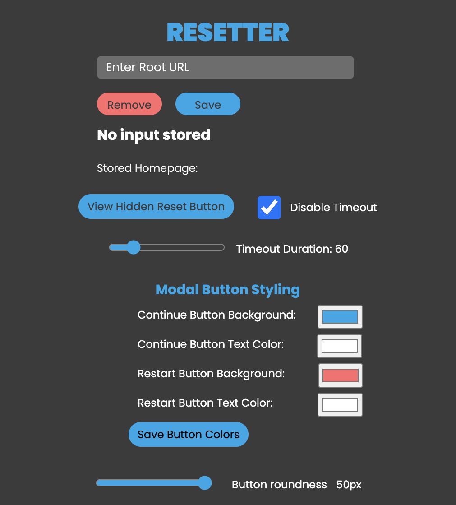
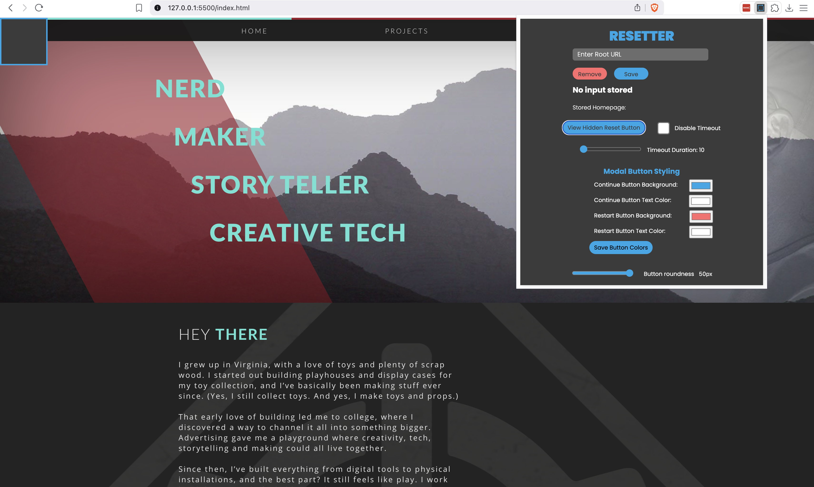
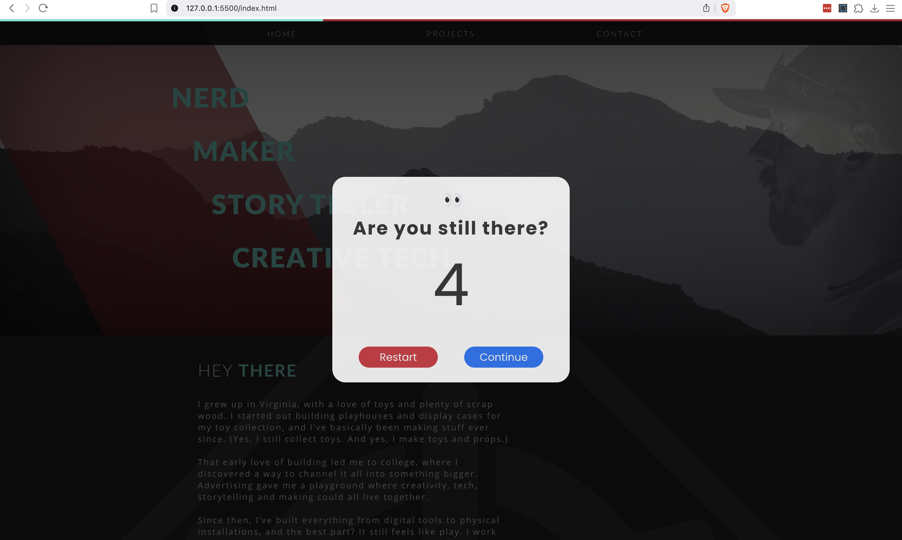

Chrome extension with two purposes. 

1. Timeout function. After X secs a modal appears with a 10 sec countdown.
2. Invisible reset button to reload the page manually.

The extension includes an input to save a URL using Chrome local storage in case you need it to go back to the root URL and not the current page. This works both with the invisible reset button and the timeout function. 

Ability to change the shape and colors of the buttons and text in the buttons.

Ability to change the amount of time before the timeout function happens. 

Ability to toggle off the timeout function.

 
 

To load the extension go to Chrome, Brave, Edge... <strong>"Extensions"</strong> page and turn on <strong>"Developer Mode"</strong> then, click <strong>"load unpacked"</strong>.
 

 
 

Here is the popup UI. There are a few things to do here.  
 

- See where the reset button is located. This can also be changed in the main.css.
- Add a <strong>"Root"</strong> URL to ensure when the reload93451 happens manually or automatically it goes back to the root URL. 
 

 
 

Image of the reset button enabled.
 

 
 

Here is the timeout function. It is set for 10 seconds. This can be changed in the content.js. The styles can be changed in the main.css
 

