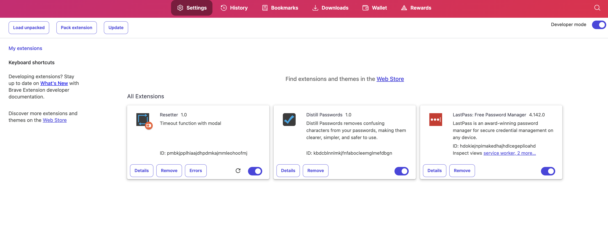

Chrome extension with two purposes. 

1. Timeout function. After 60 secs a modal appears with a 10 sec countdown.
2. Invisible reset button to reload the page manually.

The extension includes an input to save a URL using Chrome local storage in case you need it to go back to the root URL and not the current page. This works both with the invisible reset button and the timeout function. 
 
 

To load the extension go to Chrome, Brave, Edge... <strong>"Extensions"</strong> page and turn on <strong>"Developer Mode"</strong> then, click <strong>"load unpacked"</strong>.
 

 
 

Here is the popup UI. There are a few things to do here. 
 

